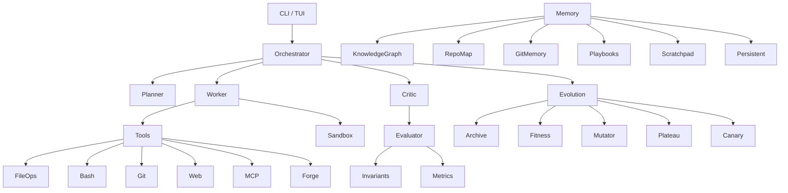

# Architecture

## System Overview

## Component Layers

### CLI Layer (`src/evolutor/cli/`)
- `app.py` — Typer-based CLI with init, task, evolve, status, rollback, history, chat, tui commands
- `config.py` — TOML + env + CLI config merging
- `chat.py` — Rich-based async REPL
- `tui.py` — Textual full-screen dashboard

### Orchestrator (`src/evolutor/orchestrator/`)
- `engine.py` — LangGraph state machine: planner → worker → critic → evaluator
- `planner.py` — Task decomposition
- `worker.py` — Subtask execution with tools
- `critic.py` — Accept/revise/reject decisions
- `scheduler.py` — Redis Streams task queue (asyncio.Queue fallback)
- `parallelism.py` — Concurrent worker runner with semaphore

### Kernel (`src/evolutor/kernel/`)
- `invariants.py` — Registry of must-hold invariants
- `evaluator.py` — Change evaluation against invariants + metrics
- `rollback.py` — Git-based savepoints
- `safety.py` — File access + command risk levels
- `trust.py` — L1–L5 agent trust scoring

### Evolution (`src/evolutor/evolution/`)
- `archive.py` — MAP-Elites GridArchive (pyribs)
- `fitness.py` — NSGA-III multi-objective (pymoo)
- `mutator.py` — 6 mutation types with heuristic selection
- `loop.py` — ask → evaluate → tell cycle
- `plateau.py` — Variance-based plateau detection
- `canary.py` — Safe rollout pattern
- `knowledge.py` — Pattern extraction from results

### Memory (`src/evolutor/memory/`)
- `knowledge_graph.py` — Code structure graph (tree-sitter + ast, networkx)
- `repo_map.py` — File relevance ranking
- `git_memory.py` — Change pattern extraction from git
- `playbooks.py` — Strategy management with delta inheritance
- `scratchpad.py` — In-memory working storage
- `persistent.py` — Long-term memory (Mem0)

### Tools (`src/evolutor/tools/`)
- `builtin/` — file_ops, bash, git, web
- `mcp/` — MCP server registry + tool search
- `forge/` — Runtime tool creation + verification + storage

### Verification (`src/evolutor/verification/`)
- `static.py` — ruff, mypy, bandit, radon integration
- `property.py` — Hypothesis property-based testing
- `adversarial.py` — Adversarial inputs + fuzzing
- `consensus.py` — Multi-agent voting
- `metrics.py` — Test + benchmark metrics collection

### Sandbox (`src/evolutor/sandbox/`)
- `docker.py` — Container lifecycle management
- `resource.py` — CPU/memory/PID limits
- `network.py` — Network isolation policies
- `snapshot.py` — Container snapshots
